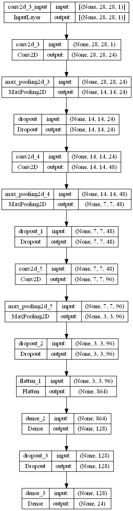

# Sign Language Recognition
The model developed can classify any letter in the American Sign Language (ASL) alphabet into the equivalent letter in the English Alphabet, which is a multiclass classification problem.

Using this model, we can easily convert the ASL into the respective English sentences.

You can view the deployed version of the model [here](https://sathwick-reddy-m-sign-language-to-text-web-app-6j4rww.streamlitapp.com/)

For a detailed explaination please refer [this](https://towardsdatascience.com/sign-language-to-text-using-deep-learning-7f9c8018c593) article

## Model Characterstics
### Input
A grayscale ASL letter image of shape (28X28)
### Output 
Equivalent letter in the English alphabet corresponding to the ASL input image

**Note**: The letters J and Z cannot be predicted as their corresponding representation in ASL requires motion.
### Evaluation
Accuracy is used as the evaluation metric
### Architecture

## Workflow
1. Importing the necessary libraries
2. Preprocessing the input data
3. Defining the Model
4. Fitting the training data
5. Hyper Parameter Tuning
6. Selection of the best model
7. Testing the performance on the test set

## Best Model After Hyperparameter Tuning
`models/experiment-dropout-0`

Tuned Hyperparmeters include
1. Convolution and Max Pooling Pairs
2. Filters in the convolution layers
3. Filter Size
4. Dropout

Hyperparameters that can be further considered

1. Batch Normalization - It normalizes the layer inputs
2. Deeper networks work well - Replacing the single convolution layer of filter size (5X5) with two successive consecutive convolution layers of filter size (3X3)
3. Number of units in the dense layer and number of dense layers
4. Replacing the MaxPooling Layer with a convolution layer having a stride > 1
5. Optimizers
6. Learning rate of the optimizer
7. Data Augmentation
